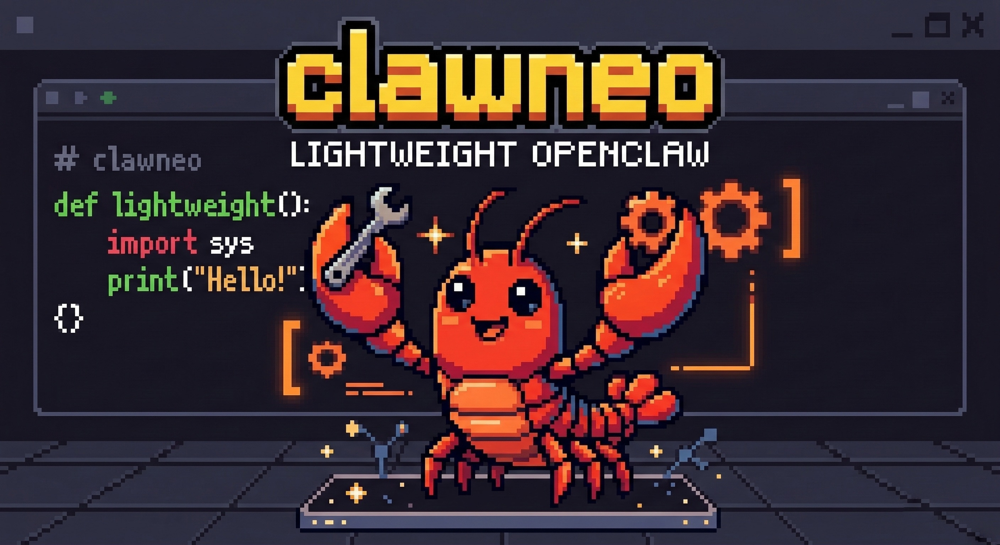

# ClawNeo

[中文](./README.zh-CN.md)

ClawNeo is a personal AI assistant CLI with a Discord bridge.

It supports:
- chatting with the assistant through Discord
- OpenAI Codex OAuth
- `read` / `ls` / `grep` / `bash` tools
- natural-language reminder tasks in Discord (experimental)
- structured user preferences
- a local status UI and basic service commands

The CLI command is `clawneo`.

## Platform Support

- macOS: supported
- Linux: experimental
- Windows: not supported yet

## Install

```bash
npm install -g clawneo
```

## Upgrade

```bash
npm install -g clawneo@latest
clawneo restart
```

Basic CLI help:

```bash
clawneo -h
clawneo --help
clawneo -v
clawneo --version
```

## Configure

```bash
clawneo config
```

To authorize or re-authorize OpenAI at any time, open `clawneo config` and select `OpenAI Settings` -> `Authorize OpenAI`.

The main config file is stored at:

```text
~/.clawneo/clawneo.json
```

## Start and Stop

On first start, ClawNeo will run an interactive onboarding flow to help you complete OpenAI authorization and the required Discord configuration.

```bash
clawneo start
clawneo stop
clawneo restart
clawneo status
clawneo ui
```

## Local Status UI

```bash
clawneo ui
```

Default address:

```text
http://127.0.0.1:3210
```

## Discord System Commands

Supported commands:

```text
/help
/status
/cancel
/restart
/stop
```

Notes:
- these commands bypass the model
- `/cancel` aborts the current running task for the current Discord session
- `/stop` will take the bot offline
- after stopping, start it again with `clawneo start`

## Reminder Tasks

ClawNeo has early support for reminder-style scheduled tasks through natural language in Discord.

Examples:

```text
20 minutes later remind me to check the logs
every day at 8 remind me to clock in
what reminders do I have
cancel the latest reminder
```

Notes:
- this feature is still experimental
- reminder delivery is designed for a single running ClawNeo instance
- timezone defaults to the current machine timezone unless you specify one explicitly

## Skills Directory

ClawNeo loads skills from:

- `~/.clawneo/skills`
- `~/.agents/skills`

When ClawNeo installs a skill for you, it uses these rules:

- default install target: `~/.clawneo/skills`
- global install target: `~/.agents/skills`
- ClawNeo only installs to `~/.agents/skills` when you explicitly ask for a global install

Example layout:

```text
~/.clawneo/skills/
  github-projects/
    SKILL.md
```

## More

For architecture details, see:
- [ARCHITECTURE.md](./ARCHITECTURE.md)
